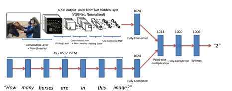
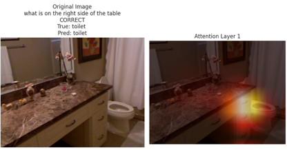
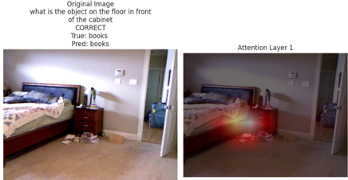
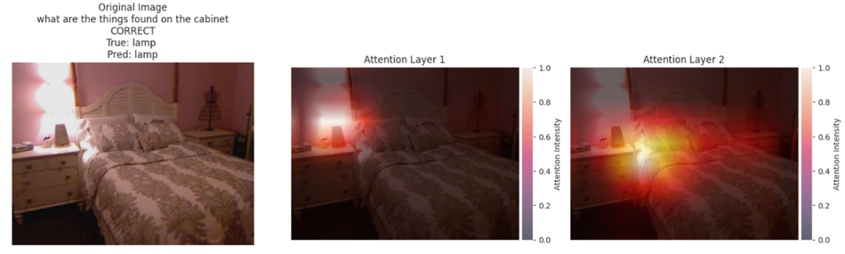
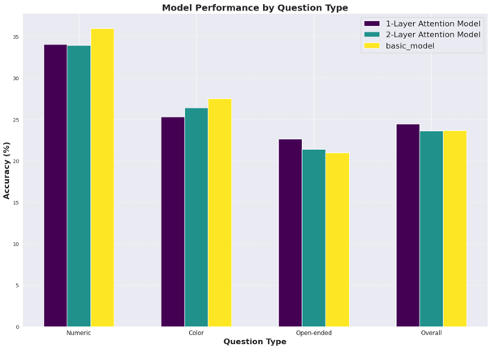
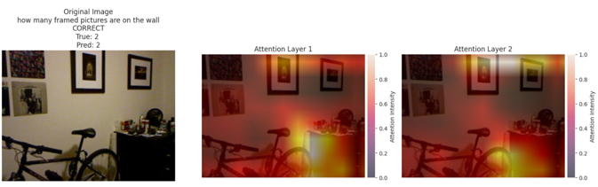

# Visual Question Answering (VQA)

## Project Overview

Visual Question Answering (VQA) is a task that involves providing answers to questions related to images. 
This task requires a model to understand both the image and the question and then select an answer from a closed set of possible answers.
 The implementation explores and compares various approaches, including the CNN-LSTM architecture and Stacked Attention Networks (SAN),
which tries to enhance the model's reasoning ability by utilizing multiple attention layers to improve answer accuracy.
 **Example**

---

## Model Architectures

### CNN + LSTM Model

* Uses a pre-trained ResNet-18 for image feature extraction.

* An LSTM to process textual questions.

* Combines image and question representations via fully connected layers.

 (Model architecture, from the paper "VQA: Visual Question Answering")

Link to the paper where the architecture was introduced: [VQA: Visual Question Answering](https://arxiv.org/pdf/1505.00468)

### Stacked Attention Network (SAN)

* Enhances VQA performance through multiple attention layers.
* Dynamically focuses on relevant image regions based on the question.
* Uses CNN for feature extraction and LSTM for question encoding.
* Implemented and evaluated with 1-layer and 2-layer attention variants.
Link to the paper where the architecture was introduced: [Stacked Attention Networks for Image Question Answering](https://arxiv.org/pdf/1511.02274)

**Attention Visualization**

Below is an example of how the Stacked Attention Network (SAN) highlights relevant regions in an image based on the question:

---
## Dataset

The project utilizes the DAQUAR dataset, which consists of:

*1449 images
*12,469 question-answer pairs
*Questions that analyze objects, attributes, and relationships within images.

The dataset is available on Kaggle: [DAQUAR Dataset](https://www.kaggle.com/datasets/tezansahu/processed-daquar-dataset/data)

---
## Results

| Question Type / Metric      | 1-Layer Attention Model | 2-Layer Attention Model | Basic Model        |
|-----------------------------|-------------------------|-------------------------|--------------------|
| **Numeric Questions**       | 34.06% (267/784)        | 33.93% (266/784)        | 35.97% (282/784)   |
| **Color-related Questions** | 25.28% (136/538)        | 26.39% (142/538)        | 27.51% (148/538)   |
| **Open-ended Questions**    | 22.64% (985/4351)       | 21.40% (931/4351)       | 20.96% (912/4351)  |
| **Overall Accuracy**        | 24.47% (1388/5673)      | 23.60% (1339/5673)      | 23.66% (1342/5673) |

The attention model shows a slight improvement over the base model, but not consistently across all categories.
This result contrasts with the findings in the referenced paper, which demonstrated a significant advantage for the attention model.

Additionally, increasing the number of attention layers does not necessarily enhance performance.
Analysis of the attention layers suggests that this may be due to the model's attention becoming less focused as more layers are added.
 **Example** 

---
## Project Notebook

The full notebook is available in the HTML and ipynb file: [notebook.html](VQA_project.html),  [notebook.ipynb](VQA_project.ipynb) 

---
## References
[Stacked Attention Networks for Image Question Answering](https://arxiv.org/pdf/1511.02274)

[VQA: Visual Question Answering](https://arxiv.org/pdf/1505.00468)

[DAQUAR Dataset](https://www.kaggle.com/datasets/tezansahu/processed-daquar-dataset/data)

